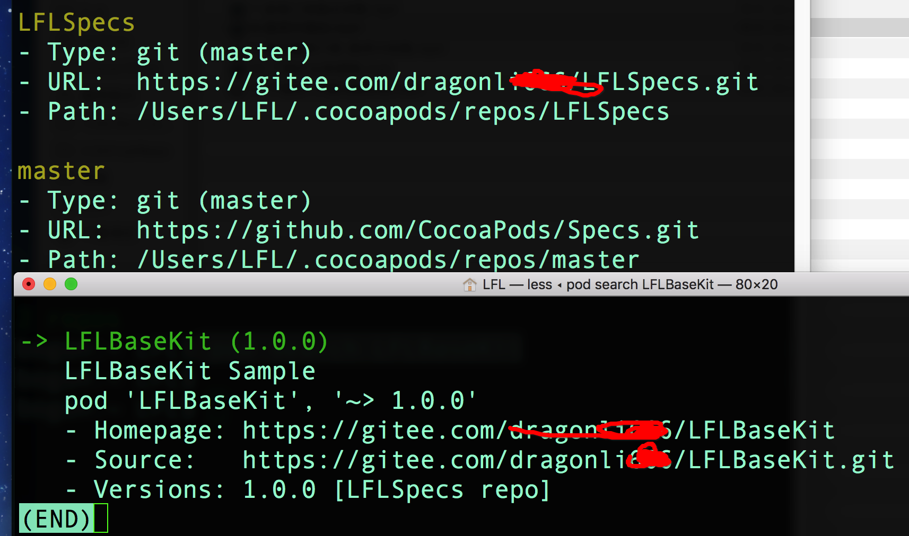

# Pod && spec

- 

## git

 - git remote add origin  https:github/DevDragonLi/kit
 - git tag -a "0.0.1" -m "add tag infos"
 - git push --tags
 - git push origin : 0.0.2  dele tag 0.0.2


## pod

###  本地pod

- **cocoapods**: **/Users/LFL/.cocoapods/repos**
- **cache**: **/Users/LFL/Library/Caches/CocoaPods/** 包含如下
	- pods :缓存已经安装的第三方
	- search_index.json 

### pod trunk

- **pod trunk register dragonli_52171@163.com 'dragonli' --description='dragonli_52171' --verbose**
	- if sucess:[!] Please verify the session by clicking the link in the verification email that has been sent to dragonli_52171@163.com

- **添加其他维护者**:**pod trunk add-owner helper emailadrss**
- **podname.podspec detail**
	- s.source_files ="class","class/**/*.{h,m,Swift}"  // * 通配符 
### create podFile and podspec
- pod init 
- pod spec create LFLPodLibName 
- pod 'LFLLib',path => '../LFLTestDemo'

- (pod 后存在Devleplent Pods)
- pod 'LFLCat' , path => 'User/LFL/Library/LFLCat/LFLCatLib' // 实际上查找LFLCat.podspec
- pod lib create [podName] 自动创建一个模板用于测试
 
## 远程私有库


###  **pic资源文件**

```
1.图片bundle 资源 
[[NSbundle bundleForClass :self] pathForResource:"" inDirectory:"当前pod库名.bundle"]


```
 	
`s.source_bundles = {
  LFLTest' => 'LFLTest/Assert/*.png'
  }`
  
- **依赖库**

`s.frameworks = 'UIKit'`

- **第三方**

`s.dependecy = 'AFNetworking'`

- **子库分离 参考 "AFN"**
	
`s.subspec 'LFLSegumentTool' do |b| 
b.source_files => 'LFLTest/LFLSegumentTool/*'
子库依赖单独处理
b.dependecy = 'GitHubSegumentTool'
end`

### example Lib

- 私有的远程索引  pod repo add LFLcocoapods URL  部署到`coding` ,`oschina`等

- pod repo remove LFLcocoapods  

- pod repo update LFLcocoapods

- pod spec lint 验证自有库 

- pod repo push LFLTest LFLTest.podspec

- pod update --no --repo 

##### lib cerate  

```
pod spec create LFLBaseKit (Specification created at LFLBaseKit.podspec) 

pod lib create LFLBaseKit  

 pod lib lint --allow-warnings   // 验证  pod spec lint 

上传到自己的 specs

pod repo push LFLSpecs LFLBaseKit.podspec --allow-warnings     : 1. 点前 repo 本地名称 2. 点前文件夹的 spec  

```


