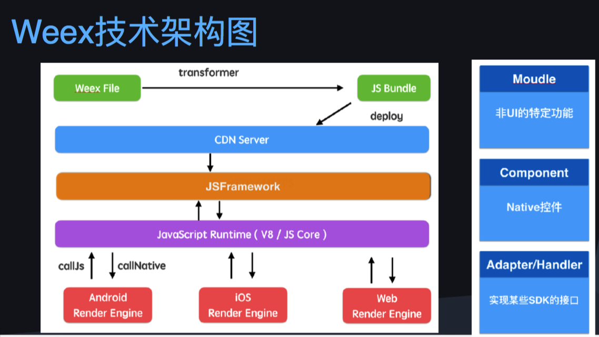

# ************ DevRepo ************

*   **[iOSDevCodeRepo](https://github.com/DevDragonLi/iOSDevCode)**
*   **[iOSNote](#iOSNote)**
*   **[iOS_Collection_article](./iOS_Collection_article_List.md)**
	- update ing
*   **[Git](#Git)**
*   **[interview-About-iOS](#interview-About-iOS)**
*   **[iOS面试题目一览表](#iOS-interview_List)**
*   **[InterviewExampleCode](https://github.com/DevDragonLi/iOSDevDemo/tree/master/InterviewExampleCode)** 
*   **[react-native](#react-native)**   
*   **[otherRepo](#other)**
*   **[iOS开发进阶-bang](#iOSDev-bang)**
		
##  iOSNote
- [**iOS架构相关**](./iOSNote/iOS_architecture.pdf)
- [**掘金客户端体积瘦身**](./iOSNote/appThin/readme.md)
- [**CocoaPods**管理库的使用技巧](./iOSNote/readme.md)
- [Controllers代码结构规范](./iOSNote/readme.md)
- [iOS技能图谱](./iOSNote/map-MobileDev-iOSDev.md)
- [Core Animation框架结构及性能调优11张大图详解](./iOSNote/Core-AnimationPerformanceOptimization/readme.md)
- [iOS核心动画高级技巧](./iOSNote/iOS-coreAnimation.md)
- [iOS_StaticLibrary](./iOSNote/iOS_StaticLibrary/readme.md)
	- **性能调优**
	- **高效绘制**
	- **图像IO**
	- **图层性能**

- [单元测试概述](./iOSNote/UnitTesting.md)
- [移动IM选择-资源待再次添加](./iOSNote/移动IM选择.pdf)
- [私有化pod总结笔记](./Pods/Pod&&spec.md)
- [私有化pod_demo](./Pods/PodPrivate_demo)

			
##  Git
- [Git指令使用总结](./Git/Git_user.md)
- [gitflow工作流](./Git/gitflow.md) 		
- [map-Git](./Git/map-Git.md)
									
##  interview-About-iOS

- [iOSDev_Skills](./interview-Set(iOS)/iOSBaseSkills-2017-05.md)

- [MrPeak的面试题目](./interview-Set(iOS)/interview-iOS-1.md)

- [interview-iOS-2](./interview-Set(iOS)/interview-iOS-2.md)

- [interview-iOS-3](./interview-Set(iOS)/interview-iOS-3.md)

- [interview-iOS-4](./interview-Set(iOS)/interview-iOS-4.md)

- [interview-iOS-5](./interview-Set(iOS)/interview-iOS-5.md)
##  other

- [ruby.taobao.org停止更新使用cocoapods更新rubychina源教程](./other/cocoapods.md)

- [ReactNative-install](./other/ReactNative-install.md) 

-  [Markdown-简单使用入门](./other/Markdown-User.md)
- 	
	
- **dev_road->>**
	- 在公司进行产品开发 && 在公司内部做技术分享；
	- 阅读优质源码和所研究领域官方文档 && 写原创技术博客对知识进行总结和分享；
	- 关注Github中优秀的开源项目并提交自己的项目；
	- 阅读相关技术书籍 && 业余时间持续学习；	
	
								
##  react-native-Resource

- RN学习资料分享
	
	- [RN中文网](http://reactnative.cn)
	- [facebook-React-native官网](https://facebook.github.io/react-native/)
	- [极客学院](http://wiki.jikexueyuan.com/project/react-native/)

- react-native-training 

	- [戳我一下呀](https://www.gitbook.com/book/unbug/react-native-training/details)

	- [非培训机构视频优酷地址](http://list.youku.com/albumlist/show?id=27615900&ascending=1&page=1)

- 开源资料部分

	- [官方参考](https://github.com/facebook/react-native/tree/master/Examples)

	- `ReactNativeSources文件夹明细(迁移文件到coding)`[直达地址](https://coding.net/u/LFL/p/GitHubRepo/git)
	- 【简寻沙龙】《加速创业的魔法-React Native》 张旭.pdf
	-  移动端会场03 朱柯军 - 《天猫 React Native 实践与探索》
	- 方志刚）React Native - iOS 开发吐槽大会  (2016-11.11 更新)

##  iOS面试题目一览表 (非全部,具体参考interview-About-iOS文件夹)

- 谈下iOS开发中知道的哪些锁? 哪个性能最差?SD和AFN使用的哪个? 一般开发中你最常用哪个? 哪个锁apple存在问题又是什么问题?
- iOS下如何实现指定线程数目的线程池?
- 如何用HTTP实现长连接？
- http的post和get啥区别
- 使用atomic一定是线程安全的吗？
- 数据库建表的时候索引有什么用？
- 介绍下iOS设备获取唯一设备号的历史变迁
- 如何使用runtime hook一个class的某个方法，又如何hook某个instance的方法？
- 聊下HTTP的POST的body体使用form-urlencoded和multipart/form-data的区别。
- 通过[UIImage imageNamed:]生成的对象什么时候被释放？
- applicationWillEnterForeground和applicationDidBecomeActive都会在哪些场景下被调用？举例越多越好。
- 如何终止正在运行的工作线程？
- iOS下所有的本地持久化方案。

- weak修饰的释放则自动被置为nil的实现原理
- HTTPS的加密原理
- 网络通讯中加密方式有哪些，各自的原理?
- 谈下开发中iOS缓存的理解
- 你认为开发中那些导致crash?
- 分析下SDWebImage (q3:内部做Decoder的原因 (典型的空间换时间)) 
- crash的收集和定位bug的方式谈下	

- SEL和Method和IMP分别说下再谈下对IMP的理解?
- Autorelease的原理 ?
-  ARC的工作原理
-  weak弱引用的代码逻辑实现?
-  大文件离线下载怎么处理?会遇到哪些问题?又如何解决
-  Socket建立网络连接的步骤

-  用户需要上传和下载一个重要的资料文件，应该如何判断用户本次是否上传成功和下载成功了?
-  ReactiveCocoa(RAC)如何防止UIButton短时间内多次重复点击，大概思路? 
-  倒计时如何实现 ？
-  熟悉 CocoaPods 么？能大概讲一下工作原理么？
-  使用SDWebImage内存爆涨的问题遇到没,怎么解决
-  isa指针的作用
-   测试都有哪些方式?优缺点呢
-   项目中你是怎么处理网络速度慢、中断抖动等网络请求中的问题?
-   项目中的图片上传功能如何实现，为什么使用队列上传，为什么不用异步上传?

- 对数组中的元素去重复 (四种)
-  请简单写出增、删、改、查的SQL语句
- 与 NSURLConnection 相比，NSURLsession 改进哪些?
- 使用drawRect有什么影响？
- 什么时候会报unrecognized selector的异常？如何避免?
-  界面多个网络请求,如何处理刷新的?
-  如果tableView界面网络请求有缓存数据逻辑?
-  init方法私有化?
-  线程中栈与堆是公有的还是私有的 ?	

##  iOSDev-bang 

## 如果你有好的资源,也可以提交或者联系我`dragonli_52171@163.com`	
