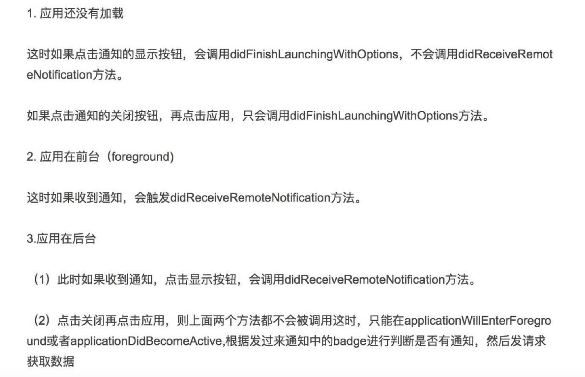
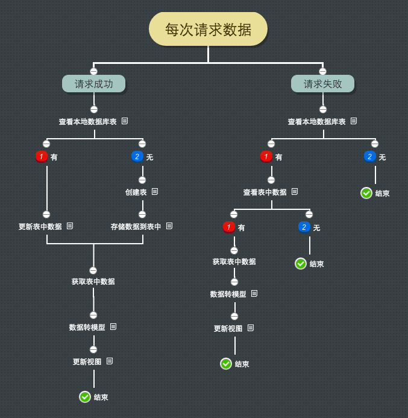

# iOSNote

*   **[iOSDev](#iOSDevPic)**

	- AFNetworking   -By雷神
	- push
	- cache


## **CocoaPods**管理库的使用技巧

- pod install --verbose --no-repo-update  只查找本地,而且不联网更新库,快!

- 使用shell的命名别名来简化

```
setup pod update alias name

alias pod_update='pod update --verbose --no-repo-update'

alias pod_install='pod install --verbose --no-repo-update'

```

## Controllers 代码结构规范
```
#pragma mark - Lifecycle

- (instancetype)init {}

- (void)dealloc {}

- (void)viewDidLoad {}

- (void)viewWillAppear:(BOOL)animated {}

- (void)didReceiveMemoryWarning {}

#pragma mark - IBActions/Event Response

- (IBAction)submitData:(id)sender {}
- (void)someButtonDidPressed:(UIButton*)button

#pragma mark - Protocol conformance
#pragma mark - UITextFieldDelegate
#pragma mark - UITableViewDataSource
#pragma mark - UITableViewDelegate

#pragma mark - Private
- (void)privateMethod {}

```


## <a name="iOSDevPic"></a> iOSDevPic

### **push**


### **cache**


### **AFNetworking** 图片太大,需要的[图片地址](https://coding.net/u/LFL/p/BlogPics/git/)下载即可
